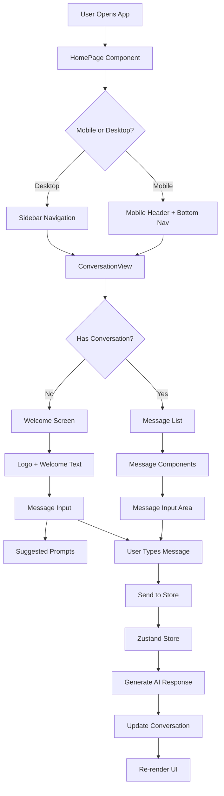
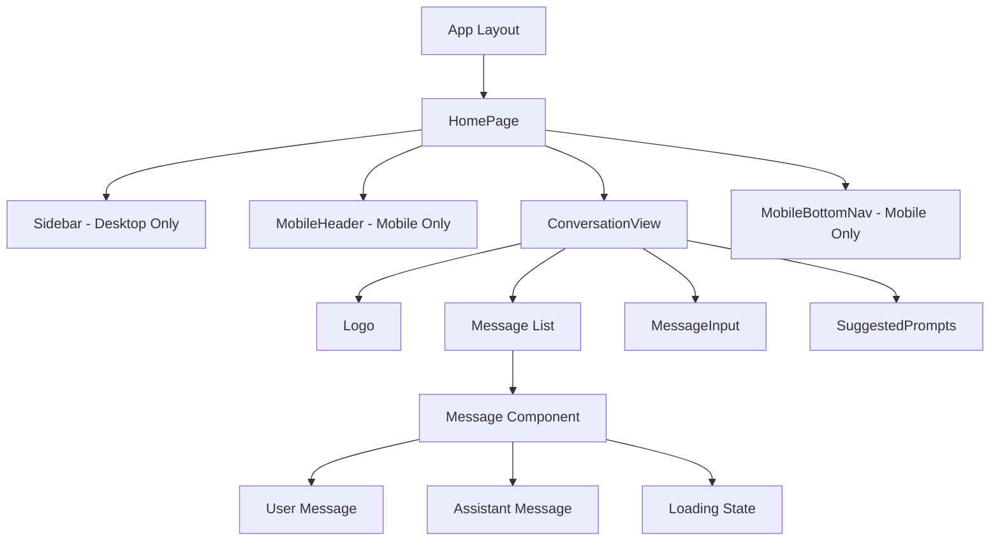

# Sentient AI Assistant

A modern, responsive AI chat interface built with Next.js 15, React 19, and TypeScript. This application provides a seamless conversational experience with an AI assistant, featuring a beautiful UI inspired by leading AI platforms.


## 🎯 Overview

Sentient AI Assistant is a full-featured chat application that demonstrates modern web development best practices. It features a responsive design that works seamlessly across desktop and mobile devices, with smooth animations and an intuitive user interface.

### Key Highlights

- 🎨 **Beautiful UI/UX**: Clean, modern interface with smooth animations
- 📱 **Fully Responsive**: Optimized for mobile, tablet, and desktop
- ⚡ **High Performance**: Built with Next.js 15 Turbopack for lightning-fast development
- 🧪 **Well Tested**: 92.55% test coverage with comprehensive unit tests
- 🏗️ **Scalable Architecture**: Modular component structure with clear separation of concerns
- 🎭 **Type Safe**: Full TypeScript implementation for better developer experience

## Screenshots


## Test coverage


## 🏗️ Architecture

### Application Flow Diagram



### Component Hierarchy



## 🛠️ Tech Stack

### Core Technologies

| Technology        | Version | Purpose                                          |
| ----------------- | ------- | ------------------------------------------------ |
| **Next.js**       | 15.3.3  | React framework with App Router, SSR/SSG support |
| **React**         | 19.0.0  | UI library with latest features                  |
| **TypeScript**    | 5.0     | Type safety and better DX                        |
| **Tailwind CSS**  | 4.0     | Utility-first CSS framework                      |
| **Zustand**       | 5.0.5   | Lightweight state management                     |
| **Framer Motion** | 12.17.0 | Smooth animations and transitions                |

### Development Tools

| Tool                      | Purpose                      |
| ------------------------- | ---------------------------- |
| **Jest**                  | Unit testing framework       |
| **React Testing Library** | Component testing utilities  |
| **Turbopack**             | Fast bundler for development |
| **ESLint**                | Code quality and consistency |

### Why This Tech Stack?

#### Next.js 15 with App Router

- **Server Components**: Better performance with server-side rendering
- **Turbopack**: Lightning-fast HMR in development
- **Built-in Optimizations**: Image optimization, font loading, etc.
- **File-based Routing**: Intuitive project structure

#### React 19

- **Latest Features**: Access to newest React capabilities
- **Improved Performance**: Better concurrent rendering
- **Enhanced DevTools**: Better debugging experience

#### TypeScript

- **Type Safety**: Catch errors at compile time
- **Better IDE Support**: Autocomplete and refactoring
- **Self-documenting**: Types serve as inline documentation
- **Refactoring Confidence**: Safe code modifications

#### Tailwind CSS 4

- **Utility-First**: Rapid UI development
- **Design Consistency**: Predefined design tokens
- **Small Bundle Size**: Only used utilities are included
- **Responsive Design**: Mobile-first approach

#### Zustand

- **Minimal Boilerplate**: Simple API compared to Redux
- **TypeScript Support**: Full type inference
- **DevTools Integration**: Easy debugging
- **Small Bundle Size**: ~8KB minified

#### Framer Motion

- **Declarative Animations**: Easy to implement and maintain
- **Gesture Support**: Touch and mouse interactions
- **Performance**: Hardware-accelerated animations
- **React Integration**: Seamless component animations

## 📁 Project Structure

```
sentient-ai-assistant/
├── src/
│   ├── app/                    # Next.js App Router
│   │   ├── layout.tsx         # Root layout
│   │   ├── page.tsx           # Home page route
│   │   └── globals.css        # Global styles
│   │
│   ├── components/            # Reusable UI components
│   │   ├── ConversationView/  # Main chat interface
│   │   ├── Logo/              # Animated logo component
│   │   ├── Message/           # Message display component
│   │   ├── MessageInput/      # Input with controls
│   │   ├── MobileBottomNav/   # Mobile navigation
│   │   ├── MobileHeader/      # Mobile header
│   │   ├── Sidebar/           # Desktop navigation
│   │   └── SuggestedPrompts/  # Prompt suggestions
│   │
│   ├── features/              # Feature modules
│   │   └── home/              # Home page feature
│   │
│   ├── store/                 # State management
│   │   └── assistant-store.ts # Zustand store
│   │
│   ├── types/                 # TypeScript types
│   │   └── assistant.ts       # Core type definitions
│   │
│   ├── lib/                   # Utilities
│   │   └── utils.ts           # Helper functions
│   │
│   └── __tests__/             # Test files
│       └── features/          # Feature tests
│           └── home/          # Home page tests
│
├── public/                    # Static assets
├── coverage/                  # Test coverage reports
└── Configuration files        # Jest, TypeScript, etc.
```

### Component File Structure

Each component follows a consistent structure:

```
ComponentName/
├── index.ts                   # Public exports
├── ComponentName.tsx          # Main component
├── ComponentName.types.ts     # TypeScript interfaces
├── ComponentName.styles.ts    # Tailwind class compositions
├── ComponentName.data.ts      # Constants and config
└── ComponentName.test.tsx     # Unit tests
```

## 🚀 Getting Started

### Prerequisites

- Node.js 18.0 or higher
- npm or yarn package manager

### Installation

1. Clone the repository:

```bash
git clone https://github.com/yourusername/sentient-ai-assistant.git
cd sentient-ai-assistant
```

2. Install dependencies:

```bash
npm install
# or
yarn install
```

3. Run the development server:

```bash
npm run dev
# or
yarn dev
```

4. Open [http://localhost:3000](http://localhost:3000) in your browser

### Available Scripts

```bash
npm run dev          # Start development server with Turbopack
npm run build        # Build for production
npm run start        # Start production server
npm run lint         # Run ESLint
npm run test         # Run tests
npm run test:watch   # Run tests in watch mode
npm run test:coverage # Generate coverage report
```

## 🧪 Testing

The project maintains high test coverage (92.55%) with comprehensive unit tests for all components and utilities.

### Running Tests

```bash
# Run all tests
npm test

# Watch mode for development
npm run test:watch

# Generate coverage report
npm run test:coverage
```

### Test Structure

- **Component Tests**: Testing UI components with React Testing Library
- **Store Tests**: Testing Zustand store actions and state
- **Utility Tests**: Testing helper functions
- **Integration Tests**: Testing component interactions

### Coverage Report

| Category   | Coverage |
| ---------- | -------- |
| Statements | 92.55%   |
| Branches   | 92.13%   |
| Functions  | 94.64%   |
| Lines      | 95.75%   |

## 🧩 Component System

### Design Principles

1. **Single Responsibility**: Each component has one clear purpose
2. **Composition over Inheritance**: Build complex UIs from simple parts
3. **Props Interface**: Clear, typed component APIs
4. **Separation of Concerns**: Logic, styles, and data separated

### Key Components

#### ConversationView

The main chat interface that handles message display and user input.

```typescript
// Handles welcome screen and active conversations
// Manages auto-scrolling and message rendering
// Integrates with Zustand store for state
```

#### MessageInput

Advanced input component with multiple features:

- Auto-expanding textarea
- File attachment support (UI only)
- Mini/Preview toggle modes
- Keyboard shortcuts (Enter to send)

#### Message

Displays individual messages with:

- User/Assistant role distinction
- Timestamp formatting
- Loading animation for AI responses
- Markdown rendering support

#### Sidebar (Desktop)

Navigation component featuring:

- Logo display
- Navigation menu
- New conversation button
- User account indicator

#### Mobile Components

Optimized for touch interfaces:

- **MobileHeader**: Compact header with menu and new chat
- **MobileBottomNav**: Bottom navigation for easy thumb access

## 🗄️ State Management

### Zustand Store Architecture

```typescript
interface AssistantStore {
  // State
  conversations: Conversation[];
  currentConversation: Conversation | null;
  isLoading: boolean;

  // Actions
  createNewConversation: () => void;
  setCurrentConversation: (conversation: Conversation | null) => void;
  sendMessage: (content: string) => Promise<void>;
  deleteConversation: (id: string) => void;
  clearAllConversations: () => void;
}
```

### State Flow

1. **User Action**: User types and sends a message
2. **Store Update**: Message added to current conversation
3. **UI Update**: React re-renders with new message
4. **AI Processing**: Mock AI generates response
5. **Store Update**: AI response added to conversation
6. **UI Update**: New message appears in chat

## 🎨 Design Decisions

### Component Architecture

**Why Component-Based Structure?**

- **Reusability**: Components can be used across different pages
- **Maintainability**: Easy to locate and modify specific features
- **Testing**: Isolated components are easier to test
- **Team Collaboration**: Clear boundaries for parallel development

**Why Features Directory Instead of Pages?**

- **Next.js App Router**: Using the App Router means routes are defined in the `app` directory
- **Separation of Concerns**: Features directory separates business logic from routing
- **Avoiding Conflicts**: Prevents Next.js from treating non-page files as routes
- **Better Organization**: Groups related components, styles, and tests together

### Styling Approach

**Why Tailwind CSS?**

- **Consistency**: Design tokens ensure uniform styling
- **Performance**: Only used styles are included in bundle
- **Developer Experience**: Rapid prototyping and iteration
- **Responsive Design**: Built-in responsive utilities

### State Management

**Why Zustand over Redux?**

- **Simplicity**: Less boilerplate code
- **Performance**: Minimal re-renders
- **TypeScript**: Better type inference
- **Bundle Size**: Smaller footprint

### Testing Strategy

**Why High Test Coverage?**

- **Confidence**: Safe refactoring and updates
- **Documentation**: Tests serve as usage examples
- **Quality**: Catch bugs before production
- **Maintenance**: Easier to onboard new developers

## 🔧 Configuration

### Environment Variables

Create a `.env.local` file for environment-specific settings:

```env
# API Configuration (when implementing real AI)
NEXT_PUBLIC_API_URL=https://api.example.com
NEXT_PUBLIC_API_KEY=your-api-key

# Feature Flags
NEXT_PUBLIC_ENABLE_ANALYTICS=true
```

### Customization

The application is built with customization in mind:

1. **Theme**: Modify Tailwind config for colors and spacing
2. **AI Responses**: Update `generateAIResponse` in store
3. **Prompts**: Customize suggested prompts in store
4. **Components**: Extend or modify existing components

## 📈 Performance Optimizations

- **Code Splitting**: Automatic with Next.js App Router
- **Image Optimization**: Next.js Image component
- **Font Loading**: Optimized web font loading
- **State Updates**: Minimal re-renders with Zustand
- **Animations**: Hardware-accelerated with Framer Motion

---

Built with ❤️ using Next.js, React, and TypeScript
